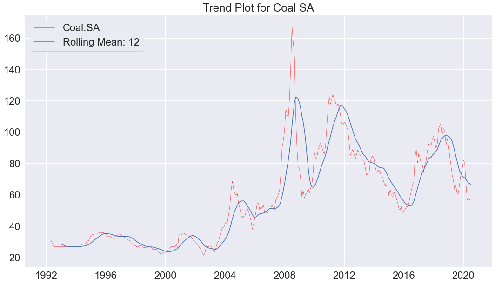
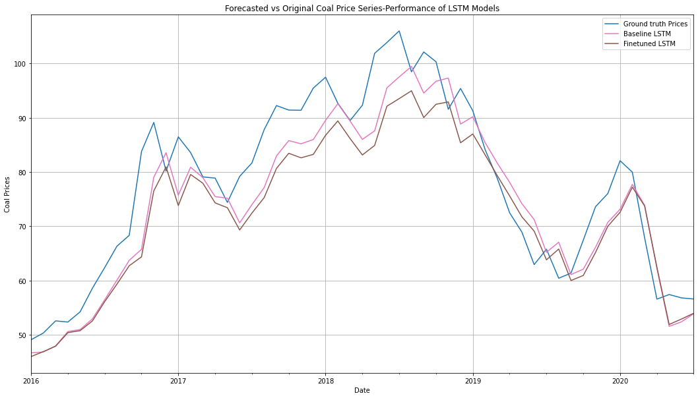
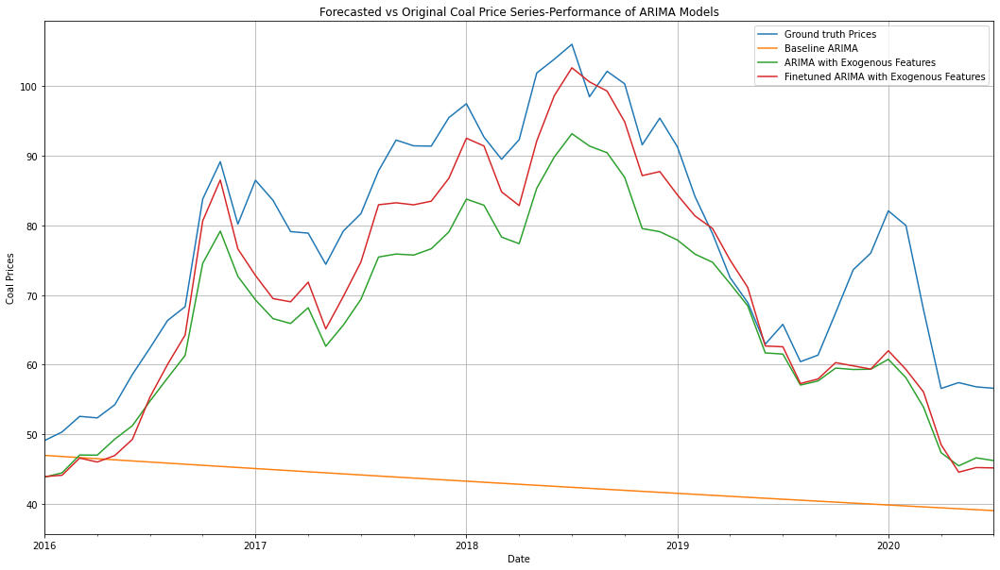

# Time Series Forecasting of Coal Prices in South Africa between 2016-2020
Forecasting plays an important role in various fields of the concern. With the help of forecasting, the enterprises can find out whether they can succeed in the new business; whether they can face the existing competition. In this project and its paper, we describe the analysis and importance of time series forecasting by taking the example of the coal prices of South Africa. We perform extensive data analysis of time series and feature selection before training the classical ARIMA model, machine learning based XGBoost model and deep learning based LSTM model. We prove that selecting better features help in increasing model’s performance. We also perform large-scale hyperparameter search using TALOS and report the results and compare all the models. We found that our XGBoost model outperforms ARIMA and LSTM model with an R2 score of 0.91 as compared to R2 0.83 of LSTM model and R2 0.71 of ARIMA model.

### Respiratory Structure
- `data`: A directory contains the raw and outlier-free datasets.
- `models`: A directory containing the best model states saved during optimization.
- `plots`: The plots we obtained after our analysis.
- `eda_outlier_removal.ipynb`: A notebook consists of time series analysis, exploratory data analysis and outlier removal approaches.
- `xgboost_model.ipynb`: A notebook to develop and train XGBoost model.
- `arima_lstm_models.ipynb`: A notebook contains ARIMA and LSTM model development and training snippet.
- `Time_series_coal_forecasting.pdf`: A project paper that explains the detailed analysis of dataset, methodologies we used and results of the model optimization.

### Script

1. Conduct time series analysis, EDA and outlier removal: `eda_outlier_removal.ipynb`

2. Train and test ARIMA and LSTM models: `arima_lstm_models.ipynb`

3. Train and test XGBoost model: `xgboost_model.ipynb`

### Results
Baseline and Finetuned LSTM model performance is depicted in the below graph.

Below graph indicates model performance of ARIMA models.

### Acknowledgments
This project is a collaborative work among Mesut Ceylan, Pratyush Singh, Rohit Kaushik and Andris Prokofjevs.

### License
This work is licensed under MIT License, however it is subject to repository-owner approval and permission for public and private usage.
